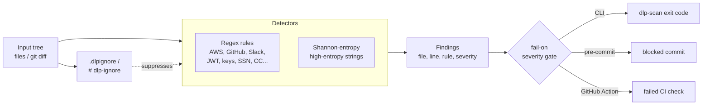

# dlp-secret-pii-scanner

[](https://github.com/John-Axe/dlp-secret-pii-scanner/actions/workflows/ci.yml)

**94% precision and 100% recall on a labeled benchmark corpus** — blocks secrets and
PII at commit time (pre-commit hook) and at merge time (GitHub Action), with the
accuracy claim backed by a benchmark you can re-run yourself, not a marketing number.

## Problem

Secrets and PII leak into source trees constantly: an `AWS_SECRET_ACCESS_KEY` pasted
into a `.env` that gets committed, a customer's SSN left in a test fixture, a private
key checked in "temporarily." Most scanners that claim to catch this never publish how
often they're wrong. This project ships its accuracy numbers as a first-class,
CI-enforced artifact: every change to the detectors re-runs against a labeled corpus,
and the build fails if precision drops below a threshold.

## Architecture



## Benchmark results

Run yourself with `python benchmark/run_benchmark.py`. Numbers below are from the
shipped corpus in `benchmark/corpus/` (12 positive files, 8 negative files), graded
per `(file, rule)` pair against `benchmark/labels.json`.

| Rule                 | TP | FP | FN | Precision | Recall | F1   |
|----------------------|----|----|----|-----------|--------|------|
| aws_access_key_id    | 2  | 0  | 0  | 1.00      | 1.00   | 1.00 |
| aws_secret_key       | 1  | 0  | 0  | 1.00      | 1.00   | 1.00 |
| credit_card          | 1  | 0  | 0  | 1.00      | 1.00   | 1.00 |
| email                | 2  | 0  | 0  | 1.00      | 1.00   | 1.00 |
| generic_password     | 2  | 0  | 0  | 1.00      | 1.00   | 1.00 |
| github_token         | 1  | 0  | 0  | 1.00      | 1.00   | 1.00 |
| gitlab_token         | 1  | 0  | 0  | 1.00      | 1.00   | 1.00 |
| high_entropy_string  | 3  | 1  | 0  | 0.75      | 1.00   | 0.86 |
| jwt                  | 1  | 0  | 0  | 1.00      | 1.00   | 1.00 |
| private_key_block    | 1  | 0  | 0  | 1.00      | 1.00   | 1.00 |
| slack_token          | 1  | 0  | 0  | 1.00      | 1.00   | 1.00 |
| us_ssn               | 1  | 0  | 0  | 1.00      | 1.00   | 1.00 |
| **OVERALL**          | **17** | **1** | **0** | **0.94** | **1.00** | **0.97** |

**Known limitation, shown honestly:** the entropy detector's one false positive is a
base64-encoded binary asset (`negatives/embedded_icon_asset.py`) — compressed/binary
data is itself high-entropy, so it looks like a secret to a pattern that only sees
character distribution. Suppress cases like this with `# dlp-ignore` once you've
confirmed the blob isn't sensitive. CI fails if overall precision drops below 85% or
recall drops below 85% (`benchmark/run_benchmark.py --min-precision --min-recall`).

## Detectors

- AWS access key IDs and secret access keys
- GitHub / GitLab tokens
- Slack tokens
- JWTs
- RSA / EC / OpenSSH / DSA / PGP private key blocks
- Generic `password=` / `pwd:` assignments
- Email addresses
- US Social Security Numbers (with basic validity checks on the area/group/serial)
- Credit card numbers (validated with the Luhn checksum to cut down on false positives)
- High-entropy strings (Shannon entropy, configurable threshold) for secrets the
  regexes miss

## Suppressing false positives

Two mechanisms, same as `.gitignore` muscle memory:

- **Inline:** add a trailing `# dlp-ignore` (or `// dlp-ignore`) comment on the line.
- **File/path-level:** add glob patterns to a `.dlpignore` file at the root of the
  scanned tree, e.g.:

  ```
  vendor/*
  *.lock
  ```

## Usage

### CLI

```bash
pip install dlp-secret-pii-scanner
dlp-scan . --format table --fail-on high
dlp-scan src/ --format json --fail-on critical --entropy-threshold 4.5
```

`--fail-on` accepts `low`, `medium`, `high`, `critical`, or `none`. Exit code is `1`
if any finding meets or exceeds the threshold, otherwise `0`.

### Pre-commit hook

Add to your `.pre-commit-config.yaml`:

```yaml
repos:
  - repo: https://github.com/John-Axe/dlp-secret-pii-scanner
    rev: v0.1.0
    hooks:
      - id: dlp-scan
```

### GitHub Action

```yaml
- uses: John-Axe/dlp-secret-pii-scanner@v0.1.0
  with:
    path: .
    fail-on: high
```

## Development

```bash
pip install -e ".[dev]"
pytest
python benchmark/run_benchmark.py
dlp-scan . --fail-on critical   # self-scan
```

## License

MIT — see [LICENSE](LICENSE).
