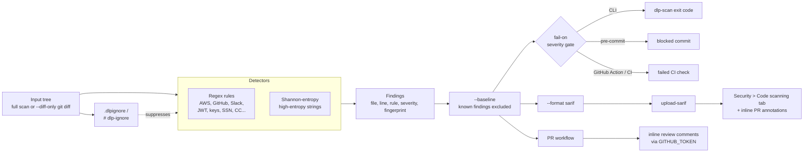

# dlp-secret-pii-scanner

[](https://github.com/John-Axe/dlp-secret-pii-scanner/actions/workflows/ci.yml)
[](https://github.com/John-Axe/dlp-secret-pii-scanner/actions/workflows/codeql.yml)
[](https://securityscorecards.dev/viewer/?uri=github.com/John-Axe/dlp-secret-pii-scanner)
[](benchmark/run_benchmark.py)
[](CONTRIBUTING.md)

**94% precision and 100% recall on a labeled benchmark corpus** — blocks secrets and
PII at commit time (pre-commit hook), at PR review time (inline comments + diff-only
checks), and at merge time (GitHub Action / Security tab), with the accuracy claim
backed by a benchmark you can re-run yourself, not a marketing number. The benchmark
badge above is generated by CI on every push to `main` — it is never hand-typed.

## Problem

Secrets and PII leak into source trees constantly: an `AWS_SECRET_ACCESS_KEY` pasted
into a `.env` that gets committed, a customer's SSN left in a test fixture, a private
key checked in "temporarily." Most scanners that claim to catch this never publish how
often they're wrong. This project ships its accuracy numbers as a first-class,
CI-enforced artifact: every change to the detectors re-runs against a labeled corpus,
and the build fails if precision drops below a threshold.

## Architecture



## Benchmark results

Run yourself with `python benchmark/run_benchmark.py`. Numbers below are from the
shipped corpus in `benchmark/corpus/` (12 positive files, 8 negative files), graded
per `(file, rule)` pair against `benchmark/labels.json`.

| Rule                 | TP | FP | FN | Precision | Recall | F1   |
|----------------------|----|----|----|-----------|--------|------|
| aws_access_key_id    | 2  | 0  | 0  | 1.00      | 1.00   | 1.00 |
| aws_secret_key       | 1  | 0  | 0  | 1.00      | 1.00   | 1.00 |
| credit_card          | 1  | 0  | 0  | 1.00      | 1.00   | 1.00 |
| email                | 2  | 0  | 0  | 1.00      | 1.00   | 1.00 |
| generic_password     | 2  | 0  | 0  | 1.00      | 1.00   | 1.00 |
| github_token         | 1  | 0  | 0  | 1.00      | 1.00   | 1.00 |
| gitlab_token         | 1  | 0  | 0  | 1.00      | 1.00   | 1.00 |
| high_entropy_string  | 3  | 1  | 0  | 0.75      | 1.00   | 0.86 |
| jwt                  | 1  | 0  | 0  | 1.00      | 1.00   | 1.00 |
| private_key_block    | 1  | 0  | 0  | 1.00      | 1.00   | 1.00 |
| slack_token          | 1  | 0  | 0  | 1.00      | 1.00   | 1.00 |
| us_ssn               | 1  | 0  | 0  | 1.00      | 1.00   | 1.00 |
| **OVERALL**          | **17** | **1** | **0** | **0.94** | **1.00** | **0.97** |

**Known limitation, shown honestly:** the entropy detector's one false positive is a
base64-encoded binary asset (`negatives/embedded_icon_asset.py`) — compressed/binary
data is itself high-entropy, so it looks like a secret to a pattern that only sees
character distribution. Suppress cases like this with `# dlp-ignore` once you've
confirmed the blob isn't sensitive. CI fails if overall precision drops below 85% or
recall drops below 85% (`benchmark/run_benchmark.py --min-precision --min-recall`).

## Detectors

- AWS access key IDs and secret access keys
- GitHub / GitLab tokens
- Slack tokens
- JWTs
- RSA / EC / OpenSSH / DSA / PGP / PKCS#8 (encrypted and unencrypted) private key blocks
- Generic `password=` / `pwd:` assignments <!-- dlp-ignore -->
- Email addresses
- US Social Security Numbers (with basic validity checks on the area/group/serial)
- Credit card numbers (validated with the Luhn checksum to cut down on false positives)
- High-entropy strings (Shannon entropy, configurable threshold) for secrets the
  regexes miss

## Suppressing false positives

Two mechanisms, same as `.gitignore` muscle memory:

- **Inline:** add a trailing `# dlp-ignore`, `// dlp-ignore`, or (for Markdown/HTML,
  which has neither native comment style) `<!-- dlp-ignore -->` on the line.
- **File/path-level:** add glob patterns to a `.dlpignore` file at the root of the
  scanned tree, e.g.:

  ```
  vendor/*
  *.lock
  ```

## Upgrades: SARIF, PR comments, diff-only/baseline, live badge, config file, parallel scanning, logging

### 1. SARIF output + GitHub Security tab

`--format sarif` emits a valid [SARIF 2.1.0](https://docs.oasis-open.org/sarif/sarif/v2.1.0/)
log: every finding maps to a stable `ruleId`, file/line/column location, a SARIF
`level` derived from severity (`low`→note, `medium`→warning, `high`/`critical`→error),
and a `partialFingerprints` entry (the same fingerprint baseline mode uses). CI runs
`dlp-scan . --format sarif --fail-on none > results.sarif` and uploads it with
[`github/codeql-action/upload-sarif`](.github/workflows/ci.yml), so findings show up
under **Security > Code scanning** and as inline annotations on PRs that touch the
flagged lines.

```bash
dlp-scan . --format sarif --fail-on none > results.sarif
```

### 2. Inline PR review comments

[`.github/workflows/pr-scan.yml`](.github/workflows/pr-scan.yml) runs on `pull_request`
and posts one inline review comment per new finding directly on the diff, using only
the built-in `GITHUB_TOKEN` — no external secrets. The posting logic lives in
`dlp.github_pr` (`python -m dlp.github_pr findings.json`) and is unit-tested with a
mocked `urlopen`, so it never makes a real network call in tests. The job's
`permissions:` block is least-privilege:

```yaml
permissions:
  contents: read
  pull-requests: write
  security-events: write
```

Capped at 25 comments per run by default (`--max-comments`), highest severity
first — a PR with hundreds of findings (e.g. a leaked-credentials dump, exactly
what this tool exists to catch) posts its most severe findings inline and prints
how many more weren't shown, instead of firing hundreds of sequential requests
and risking GitHub's secondary rate limit. A detected rate limit (429, or a 403
carrying `Retry-After`/an exhausted `X-RateLimit-Remaining`) is retried with
GitHub-directed backoff up to 3 times before giving up; a bare 403 (a real
permissions error, e.g. a token missing `pull-requests: write`) is never retried.

### 3. Diff-only scanning + baseline mode

`--diff-only` scans only files changed against `--base-ref` (default `origin/main`),
using `git diff --name-only` under the hood — a PR touching 3 files doesn't pay to
scan the other 3,000. `--baseline <file>` loads a JSON file of finding fingerprints
(`{"fingerprints": [...]}`) and excludes any matching finding from both the output and
the `--fail-on` gate, so a backlog of known/accepted findings doesn't block every future
PR — only *newly introduced* secrets fail the build. Generate or refresh a baseline
with `--write-baseline`:

```bash
dlp-scan . --write-baseline .dlp-baseline.json          # snapshot current findings
dlp-scan --diff-only --base-ref origin/main \
  --baseline .dlp-baseline.json --fail-on high           # only new findings can fail
```

A fingerprint is `sha256(file | rule_id | redacted-preview)`, truncated to 16 hex
chars - it deliberately excludes the line number so it survives unrelated edits
earlier in the file. This repo ships its own [`.dlp-baseline.json`](.dlp-baseline.json)
with one entry: the bullet describing the generic-password detector in the
[Detectors](#detectors) section above happens to be shaped like the thing it
describes, so the scanner flags its own documentation. A real example of a known,
accepted false positive, kept in the baseline instead of rewritten around.

### 4. Auto-updating benchmark badge

The benchmark badge at the top of this README is a
[shields.io endpoint badge](https://shields.io/badges/endpoint-badge) pointed at
[`.github/badges/benchmark.json`](.github/badges/benchmark.json). CI's `update-badge`
job regenerates that file on every push to `main` via
`run_benchmark.py --badge-output .github/badges/benchmark.json` and commits it back to
the repo only if the numbers changed - the badge is always exactly what the last
benchmark run produced, never hand-edited.

### 5. Per-project defaults in `pyproject.toml`

`--format`, `--fail-on`, `--no-entropy`, `--entropy-threshold`, `--no-color`, and
`--base-ref` can all live in a `[tool.dlp]` table instead of being repeated on
every invocation or wrapped in a Makefile/CI step:

```toml
[tool.dlp]
fail_on = "critical"
entropy_threshold = 4.5
```

A CLI flag always wins over the config file; `--no-config` ignores it entirely.
The nearest `pyproject.toml` walking up from the current directory is used, the
same search direction `git`/`pre-commit` use. An unknown key or an invalid value
(e.g. `fail_on = "critcal"`) fails loudly on stderr rather than being silently
ignored - see [`CONTRIBUTING.md`](CONTRIBUTING.md) for why this project prefers
explicit failure over silent misconfiguration. Uses Python's stdlib `tomllib`
(3.11+) rather than adding a TOML-parsing runtime dependency; on Python 3.10
(still within this project's supported range) config loading is a documented
no-op, not a crash - the CLI works exactly as it always has, just without this
one convenience.

### 6. Parallel scanning (`--jobs`)

```bash
dlp-scan . --jobs 4     # scan with 4 worker processes
dlp-scan . --jobs 0     # use every available CPU
```

Default is `--jobs 1` (sequential, unchanged from before this flag existed).
Uses a *process* pool, not threads — measured empirically before choosing:
threading was consistently *slower* than sequential for this workload (GIL
contention on CPU-bound regex matching), while multiprocessing measured a
real 1.4-3.6x speedup at 2-8 workers against a 3000-file synthetic corpus,
confirmed end-to-end through the real CLI (~2.5x on a 3000-file/11MB corpus,
byte-identical JSON output to sequential). Output — findings, their order,
and `ScanStats` totals — is identical to `--jobs 1` for the same input; only
wall-clock time differs. Mainly worth it for a full-repo scan; a small
`--diff-only` PR check has too few files for process-pool startup cost to
pay for itself.

### 7. `-v`/`--verbose` and `-q`/`--quiet`

Default output is unchanged from before these flags existed: findings on
stdout, and a stderr notice only if files were skipped (see above). `-v`
additionally logs the resolved scan configuration (format, fail-on, entropy
threshold, job count, whether a config file was loaded) and a completion
summary (finding count, elapsed time) to stderr; `-vv` doesn't add more
today but is accepted for forward compatibility. `-q` suppresses the
skipped-files stderr notice too — findings output and the exit code are
never affected by either flag, only stderr logging. `-q` wins if both are
given, regardless of order.

## Usage

### CLI

```bash
pip install dlp-secret-pii-scanner
dlp-scan . --format table --fail-on high
dlp-scan src/ --format json --fail-on critical --entropy-threshold 4.5
dlp-scan . --format sarif --fail-on none > results.sarif
dlp-scan --diff-only --base-ref origin/main --baseline .dlp-baseline.json --fail-on high
```

`--format` accepts `table`, `json`, or `sarif`. `--fail-on` accepts `low`, `medium`,
`high`, `critical`, or `none`. Exit code is `1` if any (non-baselined) finding meets
or exceeds the `--fail-on` threshold, otherwise `0`.

### Pre-commit hook

Add to your `.pre-commit-config.yaml`:

```yaml
repos:
  - repo: https://github.com/John-Axe/dlp-secret-pii-scanner
    rev: v0.1.0
    hooks:
      - id: dlp-scan
```

### GitHub Action

```yaml
- uses: John-Axe/dlp-secret-pii-scanner@v0.1.0
  with:
    path: .
    fail-on: high
```

## Security

This repo practices what it scans for:

- **[CodeQL](.github/workflows/codeql.yml)** static analysis on every push, every PR,
  and a weekly schedule, results in the Security tab.
- **[OpenSSF Scorecard](.github/workflows/scorecard.yml)** runs weekly and on push to
  `main`, publishes results and the badge above, and uploads its own SARIF.
- **[Dependabot](.github/dependabot.yml)** watches both the `pip` and `github-actions`
  ecosystems on a weekly schedule.
- **[gitleaks](.github/workflows/gitleaks.yml)** runs as an independent second opinion
  on secret-scanning, separate from this project's own detectors.
- Every workflow pins third-party Actions to a full commit SHA (with the version in a
  trailing comment, e.g. `actions/checkout@9c091bb... # v7.0.0`), declares an explicit
  least-privilege `permissions:` block (default `contents: read`, broadened only where
  a job needs it), and cancels superseded runs via a `concurrency:` block.

## Development

```bash
pip install -e ".[dev]"
pytest
python benchmark/run_benchmark.py
python benchmark/run_benchmark.py --badge-output .github/badges/benchmark.json
python benchmark/run_throughput_benchmark.py   # files/sec, MB/sec — not CI-gated, see its docstring
dlp-scan . --fail-on critical   # self-scan
```

## License

MIT — see [LICENSE](LICENSE).
