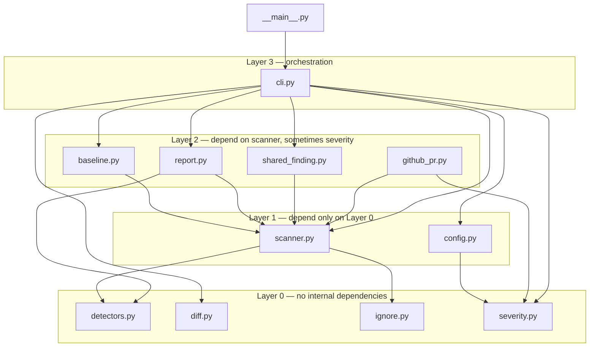
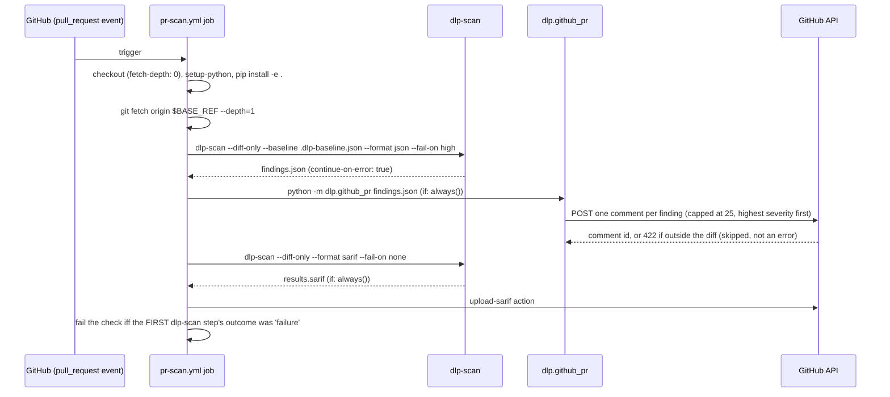
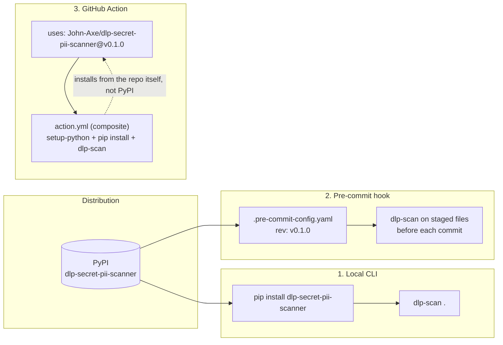

# Architecture

The scan pipeline (input → detectors → findings → severity gate → SARIF/PR
comments) is already diagrammed and explained in
[`README.md`](../README.md#architecture) — not reproduced here, so there's
one diagram to keep current instead of two drifting apart. This document
covers what the README doesn't: the module structure underneath that
pipeline, and how the pieces actually run in practice (CI, pre-commit,
local CLI).

## Repository structure

```
src/dlp/            the installable package
  cli.py               argparse entry point + logging config
  config.py            pyproject.toml [tool.dlp] loading
  scanner.py            file walk, Finding, ScanStats, parallel scan
  detectors.py           11 detectors (10 regex + Shannon-entropy)
  report.py              table / json / sarif rendering
  baseline.py             fingerprint-based suppression
  diff.py                 git diff wrapper for --diff-only
  ignore.py                .dlpignore + inline # dlp-ignore
  github_pr.py             inline PR review comments
  shared_finding.py         maps onto the ecosystem-wide finding schema
  py.typed                  PEP 561 marker - this package ships types
scripts/
  coverage_badge.py     shields.io badge from a coverage.py report
benchmark/
  run_benchmark.py       precision/recall/F1, CI-gated
  corpus/, labels.json      the labeled benchmark fixtures
  run_throughput_benchmark.py  files/sec, MB/sec, NOT CI-gated
fuzz/
  fuzz_scanner.py        atheris fuzz target, CI-gated (10k iterations)
tests/                 one file per src/dlp/ module, plus:
  test_parallel_scanning.py  --jobs correctness (order/stats parity)
  test_performance_smoke.py   catastrophic-regression guard
  test_detectors_properties.py  hypothesis property tests
docs/
  adr/                  Architecture Decision Records
  Limitations.md, Threat-Model.md, Architecture.md (this file), ...
```

## Component diagram — module dependency graph

Extracted directly from the actual `from .` import statements in
`src/dlp/*.py` (verified with `grep`, not inferred from module names), not
an idealized version of the architecture:



**No circular imports** — the layering above isn't aspirational, it's what
`grep -n "^from \." src/dlp/*.py` actually returns. `cli.py` is
deliberately the only module with more than 2-3 internal dependencies: it's
thin orchestration, importing everything else and calling it, with no
detection or business logic of its own (see the original engineering audit's
Architecture section for why that shape matters — every other module stays
independently importable and testable without pulling in argument parsing).

## Sequence diagram — a real CI run

The exact flow `.github/workflows/pr-scan.yml` runs on every `pull_request`
event, reproduced from the workflow file itself, not paraphrased:



The pass/fail decision comes entirely from the first `dlp-scan` invocation's
exit code (the uncapped, complete finding set) — the comment-posting step's
25-comment cap never affects it. See
[`Threat-Model.md`](Threat-Model.md) and [`Limitations.md`](Limitations.md)
for why that separation matters.

## Deployment diagram — the three ways this runs



All three run the identical `dlp-scan` CLI — there's no separate
"pre-commit mode" or "Action mode" binary, just different callers passing
different flags. This is why a bug fix in `src/dlp/` fixes all three
surfaces at once, and why `CONTRIBUTING.md`'s pre-PR checklist (`pytest`,
the benchmark gate, the self-scan) is sufficient verification regardless of
which distribution channel a change will ultimately be exercised through.

## Release pipeline

Not documented anywhere else in this repo despite being genuinely more
sophisticated than most projects this size — worth stating plainly rather
than assuming a reader will find it by reading
[`.github/workflows/release.yml`](../.github/workflows/release.yml) directly.
Triggered by a `v*` tag push:

1. Build sdist + wheel (`python -m build`).
2. Generate SLSA provenance hashes of the build artifacts.
3. Sign the artifacts with Sigstore (keyless, via OIDC — no stored signing key).
4. Create a GitHub Release with auto-generated notes, attaching the signed artifacts.
5. Publish to PyPI via a Trusted Publisher (OIDC, no stored API token) —
   this step is `continue-on-error: true` in the workflow, with the comment
   "non-fatal until PyPI Trusted Publisher is configured": the mechanism is
   built and wired up, but whether it actually succeeds depends on PyPI-side
   configuration this document can't verify from the repo alone. Don't take
   "the workflow has a PyPI-publish step" as confirmation that publishing
   currently works end-to-end.
